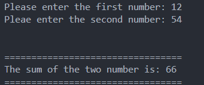

# Additon Caluclator

## Description

This is a simple calculator program that will add two number inputs.

## Concepts Used

- Arithmetic Operator
- Cin, Cout
- Variables

## Sample Output

Enter the first number: 4

Enter the second number: 14

Sum of the two number is: 18

## Screenshot

