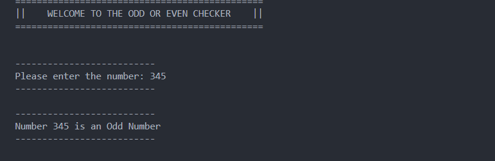

# Odd or Even Checker

## Description

This program checks whether a number is odd or even. The program also has a feature that will validate the input of the user. With the use of the while statement, we can guarantee that the correct data will be accepted and run by the program.

This program checks whether a number is odd or even.

## Concepts Used

- if-else

- while

- modulo operator

## Sample Output

Enter number: 4
Even

## Screenshot

