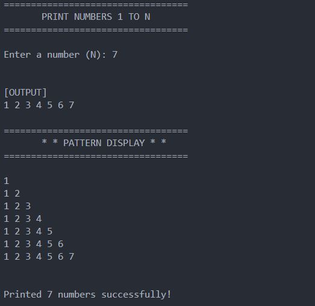

# Print 1 to N

## Description

This program will print the input number from 1 to N.

## Concepts Used

- For loop
- cin, cout

## Sample Output

Enter a number (N): 7

[OUTPUT]

1 2 3 4 5 6 7

## Screenshot

