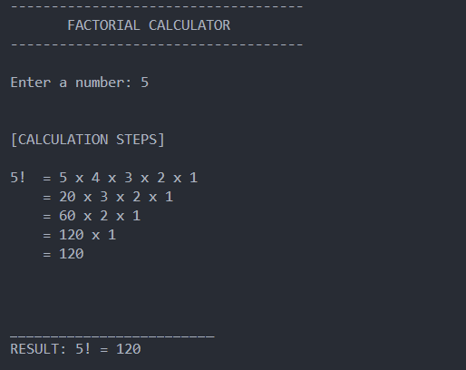

# Factorial Calculator

## Description

This program will calculate the factorial of a number. However the program will only calculate the factorial of numbers that are less than or equal to 10.

## Concepts Used

- For loop

- if-else

- Nested for loop

## Sample Output

Enter a number: 5

Factorial of 5 is 120

## Screenshot

